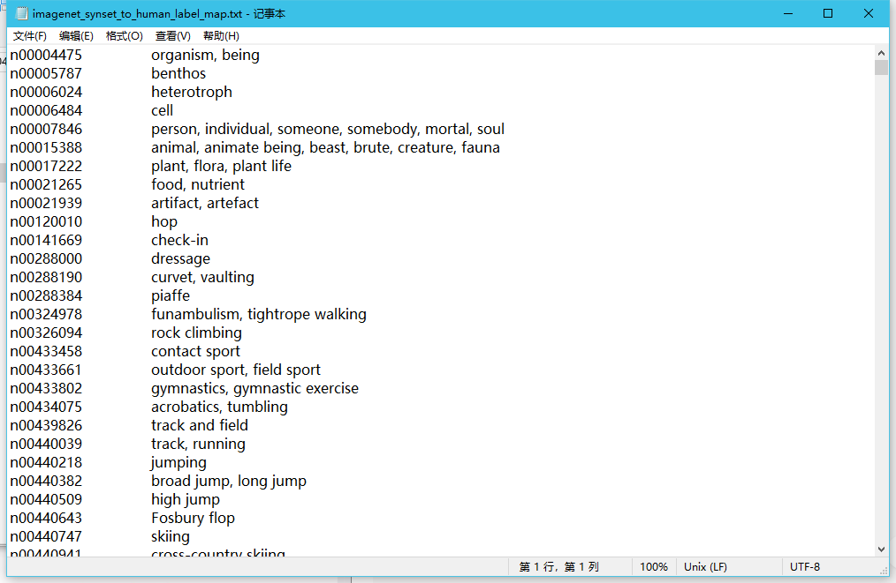
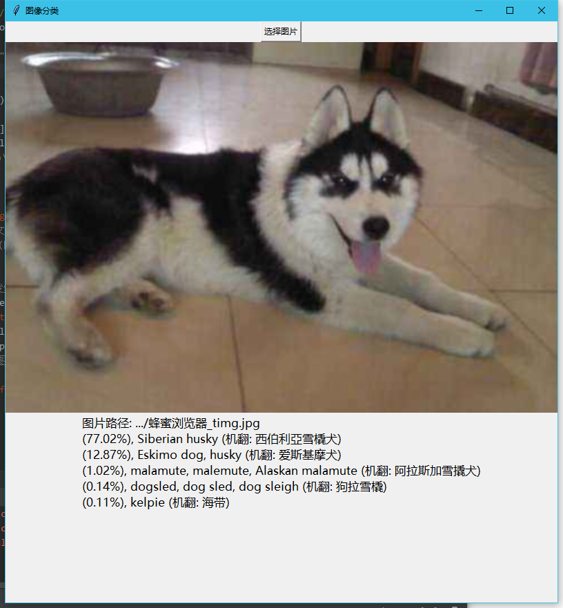

# 1.项目简介

**主要功能**：利用**InceptionV3**[[论文](https://arxiv.org/abs/1512.00567)]模型进行图像分类任务

**环境**：**anaconda+Python3+tensorflow**

**IDE**：**pycharm + jupyter notebook**


# 2.代码框架

需要的库模块: 

* ```python
  os
  tarfile
  requests
  tensorflow
  numpy
  translate
  PIL
  ```

  

项目主要使用了类和模块化处理的思想，一共四个代码文件:

* get_Inception_model.py

  方法模块，下载模型将模型保存到本地

  ```python
  def download_inception_model(): #下载模型将模型保存到本地
      '......'
      
  ```

* nodelookup.py

  类文件，主要功能将官方标签解码成可读文本

  ```python
  class NodeLookup(object):
      def __init__(self):
          self.node_lookup  # 字典,id to string
          '......'
          
      @staticmethod
      def _load(labels_path, uids_path):  # 输入:node_id, 输出:id to string字典
      	'......'
      	return dict
      
      def id_to_string(self, node_id):  # 输入:node_id, 输出:可读字符串
          '......'
      	return str
  ```

* tensorflow_predictor.py

  类文件，主要功能实现图像预测

  ```python
  class TensorflowPredictor():
      def __init__(self):  # 加载模型，新建session，
          '......'
  
      def predict_image(self, image_path):  # 
          '......'
          return str
  
  ```

  

* gui.py

  界面代码，面向用户
  
  ```python
  btn_sel  # 选择图片按钮
  img_label  # 这是是显示预测图片的全局变量
  res_label  # 这是是显示预测文字的全局变量
  
  def translator_prediction_result(pre_res):# 翻译模块 输入:英文字符串，输出:格式化中文字符串
  	'......'
      return res
  
  def selector_image():  # 选择图片按钮点击发生的事件
      '......'
      
  root.mainloop()  # 进入消息循环
  ```
  
  


# 3.实现细节


## 3.1.下载模型


### 3.1.1.实现功能

下载模型将模型保存到本地


### 3.1.2.Inception文件简介

[Inception_v3模型源码下载](https://link.jianshu.com/?t=https://github.com/tensorflow/tensorflow/blob/master/tensorflow/contrib/slim/python/slim/nets/inception_v3.py)

Inception为Google开源的CNN模型，至今已经公开四个版本，每一个版本都是基于大型图像数据库ImageNet中的数据训练而成。因此我们可以直接利用Google的Inception模型来实现图像分类。本项目主要以Inception_v3模型为基础。分类一张图像可以在几秒内完成。

- InceptionV3网络图


### 3.1.3.流程图

```flow
#operation
st=>start: 开始
end=>end: 结束
cd1=>condition: 不存在"inception_model"文件夹？
op1=>operation: 下载模型压缩包inception-2015-12-05.tgz
op2=>operation: 创建"inception_model"文件夹
op3=>operation: 解压inception-2015-12-05.tgz
io1=>inputoutput: 打印"Downloading file"
done=>inputoutput: 打印"Done."
str=>inputoutput: 预测结果字符串

cd1(yes)->op2->op1->op3->done->end
cd1(no)->end
```


### 3.1.4.代码

```python
# get_Inception_model.py

import tarfile
import requests


def download_inception_model():
    # inception_v3模型下载
    inception_pre_mod_url = 'http://download.tensorflow.org/models/image/imagenet/inception-2015-12-05.tgz'
    # 模型存放地址
    inception_pre_mod_dir = "inception_model"
    if not os.path.exists(inception_pre_mod_dir):
        os.makedirs(inception_pre_mod_dir)
    # 获取文件名，以及文件路径
    filename = inception_pre_mod_url.split('/')[-1]
    filepath = os.path.join(inception_pre_mod_dir, filename)
    # 下载模型
    if not os.path.exists(filepath):
        print('Downloading: ', filename)
        r = requests.get(inception_pre_mod_url, stream=True)
        with open(filepath, 'wb') as f:
            for chunk in r.iter_content(chunk_size=1024):
                if chunk: f.write(chunk)
    print("Done: ", filename)
    # 解压文件
    tarfile.open(filepath, 'r:gz').extractall(inception_pre_mod_dir)
```


## 3.2.标签解码


### 3.2.1.实现功能

将标签编码和标签内容一一对应（解码）


### 3.2.2.文件

官方下载的文件夹下有两个文件

- imagenet_synset_to_human_label_map.txt  
- <!--每一行左边是一个编号，右边的字符串是这个编号对应的分类结果-->



* imagenet_2012_challenge_label_map_proto.pbtx


target_class对应着一个class_string，这里我们要做的任务就是将traget_class与human_string一一对应


### 3.2.3.代码

```python
# nodelookup.py

import tensorflow.compat.v1 as tf
tf.disable_v2_behavior


class NodeLookup(object):
    def __init__(self):
        labels_path = 'inception_model/imagenet_2012_challenge_label_map_proto.pbtxt'
        uids_path = 'inception_model/imagenet_synset_to_human_label_map.txt'
        self.node_lookup = self.load(labels_path, uids_path)

    @staticmethod
    def _load(labels_path, uids_path):
        uid_to_human = {}
        for line in tf.gfile.GFile(uids_path).readlines():
            items = line.strip('\n').split('\t')
            uid_to_human[items[0]] = items[1]
        node_id_to_uid = {}
        for line in tf.gfile.GFile(labels_path).readlines():
            if line.startswith('  target_class:'):
                target_class = int(line.split(': ')[1])
            if line.startswith('  target_class_string:'):
                target_class_string = line.split(': ')[1]
                node_id_to_uid[target_class] = target_class_string[1:-2]
        node_id_to_name = {}
        for key, val in node_id_to_uid.items():
            name = uid_to_human[val]
            node_id_to_name[key] = name
        return node_id_to_name

    def id_to_string(self, node_id):
        if node_id not in self.node_lookup:
            return ''
        return self.node_lookup[node_id]
```


## 3.3.运行模型


### 3.3.1.流程图

```flow
#operation
st=>start: 开始
e=>结束
sub1=>subroutine: My Subroutine
image=>inputoutput: 图像文件
model=>subroutine: 模型预测函数
str=>inputoutput: 预测结果字符串

image->model->str
```


### 3.3.2.代码

```python
import tensorflow.compat.v1 as tf

tf.disable_v2_behavior
import numpy as np
import nodelookup


class TensorflowPredictor():
    def __init__(self):
        self.sess = tf.Session()
        with tf.gfile.FastGFile('./inception_model/classify_image_graph_def.pb', 'rb') as f:
            graph_def = tf.GraphDef()  # 定义一个计算图
            graph_def.ParseFromString(f.read())  #
            tf.import_graph_def(graph_def, name='')
        self.softmax_tensor = self.sess.graph.get_tensor_by_name('softmax:0')

    def predict_image(self, image_path):
        # 载入图片
        image_data = tf.gfile.FastGFile(image_path, 'rb').read()
        predictions = self.sess.run(self.softmax_tensor, {'DecodeJpeg/contents:0': image_data})  # 图片格式是jpg格式
        predictions = np.squeeze(predictions)  # 把结果转为1维
        # 打印图片路径及名称
        res_str = ''
        res_str += '图片路径: ' + image_path + '\n'
        # 排序
        top_k = predictions.argsort()[-5:][::-1]
        node_lookup = nodelookup.NodeLookup()
        for node_id in top_k:
            # 获取分类名称
            name_str = node_lookup.id_to_string(node_id)
            # 获取该分类的置信度
            score = predictions[node_id] * 100
            res_str += '(%.2f' % (score) + '%), ' + name_str + '\n'
        return res_str
```


## 3.4.GUI


### 3.4.1.运行图



### 3.4.2.代码

```python
import os
import tkinter
from tkinter import *
from tkinter import filedialog
from PIL import ImageTk
from translate import Translator

import get_Inception_model
from tensorflow_predictor import TensorflowPredictor

root = tkinter.Tk()  # 生成root主窗口
root.title("图像分类")  # 设置窗体标题
root.geometry("800x800")  # 设置窗体大小

if not os.path.exists('./inception_model/classify_image_graph_def.pb'):  # 如果没下载model，则下载model
    get_Inception_model.download_inception_model()  # 下载model

translator = Translator(to_lang="chinese")  # 新建Translator对象

def translator_prediction_result(pre_res):  # 翻译模块
    res = pre_res.split("\n")[0] + '\n'
    for line in pre_res.split("\n")[1:-1]:
        s = translator.translate(line.split(',')[1])
        res += line + " (机翻结果: " + s + ")\n"
    return res  # 返回翻译结果


img_label = Label(root, width='800', height='533')  # 这是是显示预测图片的全局变量
res_label = Label(root)  # 这是是显示预测文字的全局变量
pdt = TensorflowPredictor()  # 新建预测类(自己写的)


def selector_image():  # 选择图片按钮点击发生的事件
    img_path = filedialog.askopenfilename(initialdir='./images')  # 弹窗选择图像文件返回图像地址
    pre_res = pdt.predict_image(image_path=img_path)  # 利用地址调用预测函数返回结果字符串
    pre_res = translator_prediction_result(pre_res)  # 机器翻译结果字符串
    photo = ImageTk.PhotoImage(file=img_path)
    img_label.config(imag=photo)  # 更新图片
    img_label.pack()
    res_label.config(text=pre_res, justify=LEFT)  # 更新文字
    res_label.pack()
    root.mainloop()  # 进入消息循环
    return


btn_sel = tkinter.Button(root, text='选择图片', command=selector_image)  # 选择图片按钮
btn_sel.pack()

root.mainloop()  # 进入消息循环（必需组件）
```

